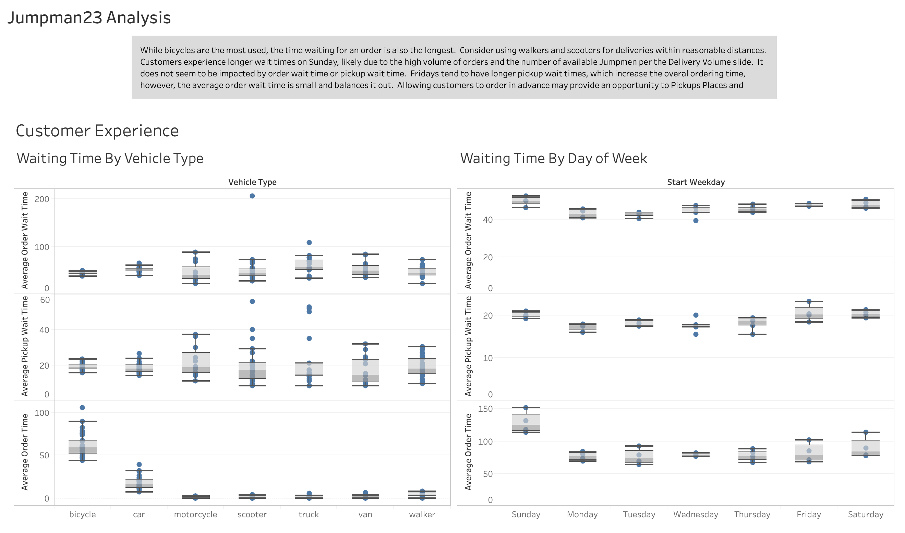

# Jumpman23 Market Analysis

## Table of Contents
* [Technologies](#Technologies)
* [Objective](#Objective)
* [Number Process](#Process)
* [Written Analysis](#Analysis)
* [Visualizations](#Visualizations)

# Technologies
* Python
* SQL
* Tableau

# Objective | Market Analysis
Assuming the role of a Marketing Analyst for Jumpman23, provide an analysis of the market. In addition, review the reports to evaluate the data for integrity issues and if they indeed exist, outline where they may be and how they may impact the analysis. Provide summary, process code, visualizations and map details of finding.

# Process
* Determine data integrity: remove duplicates, analyze null values
```
#Add fields for pickup/order wait times
delivery_data['pickup_wait_time'] = (delivery_data.when_the_Jumpman_left_pickup - delivery_data.when_the_Jumpman_arrived_at_pickup)  
delivery_data['order_wait_time'] = (delivery_data.when_the_Jumpman_arrived_at_dropoff - delivery_data.when_the_delivery_started)   
delivery_data.head()
```
```# Find duplicate orders
duplicate_orders = delivery_data[delivery_data.duplicated()]
duplicate_orders
```

* Analyze vehicle usage types
```# Determine uniquie vehicle types
vehicle_type = delivery_data["vehicle_type"].unique()
print(vehicle_type)
```
```
# Extract the following columns: "vehicle_type" and "item_quantity"
vehicle_type = delivery_data[["vehicle_type", "item_quantity"]]
vehicle_type.head()
```
```
# Create a dataframe of the average quantity of items for each type of vehicle.
vehicle_group = vehicle_type.groupby(["vehicle_type"])

delivery_time_comparison_df = vehicle_group.mean()
delivery_time_comparison_df
```

* Analyze delivery volume
```print('Deliveries by day')
delivery_by_day = delivery_data.groupby(delivery_data.Start_Weekday).size().sort_values(ascending=False).reset_index(name='count')
delivery_by_day
```
```
# Analyze order volume
for field, desc in {'delivery_id':'orders','pickup_place':'pickup places',
        'customer_id':'customers','jumpman_id':'delivers','item_name':'items','place_category':'place categories'}.items():
    print('Number of %s:'% desc,len(delivery_data[field].unique()))
```

* Analyze customer preference data
```
print('Most popular pickup places')
pickup_places = delivery_data.groupby('pickup_place').size()
pickup_places.sort_values(ascending=False).head(20).reset_index(name='count')
```
```
print('Most active customers')
customers = delivery_data.groupby('customer_id').size()
customers.sort_values(ascending=False).head(20).reset_index(name='count')
```
```
# Determine 10 most popular place categories
popular_places = delivery_data.groupby('place_category').size().sort_values(ascending=False)
popular_places.head(10)
```
* Analyzie customer experience
```
# Determine longest order wait times
print('Longest Order Wait Time')
delivery_data.groupby('pickup_place').how_long_it_took_to_order.describe()['mean'].sort_values(ascending=False).head(20)
```
```
# Determine longest pickup wait times
print('Longest Pickup Wait Times')
delivery_data.groupby('pickup_place').pickup_wait_time.describe()['mean'].sort_values(ascending=False).head(20)
```

# Analysis
* Data Integrity Analysis
While the provided data appears to be consistent in formatting, there is a significant number of missing data. Specifically, how_long_it_took_to_order contains less than 50% of the required data which, if completed, could help to improve customer experience. Additional priority details that contain missing data include: place_category, item_name, item_quantity, item_category_name, when_the_Jumpman_arrived_at_pickup, and when_the_Jumpman_left_pickup. Finally, of the 5983 unique orders, 16 were duplicate orders.

* Vehicle Usage Analysis
Pickup locations and deliveries are located primarily in Manhattan, with a smaller number of orders placed in Brooklyn. Very few occur in Queens, The Bronx and Staten Island. The main mode of transportation is bicycle. One opportunity to increase market share may be to focus marketing efforts on the outer boroughs, starting with Queens as that might be a more active market.


* Delivery Volume Analysis
Delivery volume appears to remain consistent over a one month period, with Mondays being the slowest day for deliveries and Sunday being the busiest. However, there does not seem to be a significant increase in Jumpmen on Sundays. An opportunity for growth here may be a Monday Night Footbal promotion in order to entice more customers during that slow time. Additionally, in order to increase customer frequency, provide them with an opportunity to order three meals per week in advance in order to ensure repeat business. For instance on Fridays, allow people to order for the upcoming week, Burgers on Monday, Japanese on Wednesday, and Italian on Sunday and receive a small discount.


* Customer Preferences
Customers have a strong preference for Burgers, liking Shake Shack over all others. Sides and Appetizers come in a close second, though the pickup place for that varies. Desserts are also popular. However, the average customer purchase only 1.2 items per order. One opportunity for growth may be to offer a future bonus, like $5 off the next order for orders over $30, encouraging customers to increase their item purchase.


* Customer Experience
While bicycles are the most used, the time waiting for an order is also the longest. Consider using walkers and scooters for deliveries within reasonable distances. Customers experience longer wait times on Sunday, likely due to the high volume of orders and the number of available Jumpmen per the Delivery Volume slide. It does not seem to be impacted by order wait time or pickup wait time. Fridays tend to have longer pickup wait times, which increase the overal ordering time, however, the average order wait time is small and balances it out. Allowing customers to order in advance may provide an opportunity to Pickups Places and Jumpmen to be scheduled more efficiently to provide faster service.


# Visualizations | Tableau
Full Story can be found at:
https://public.tableau.com/profile/lisa.reed.preston#!/vizhome/Jumpman23October2014Analysis/VehicleUsageStory
